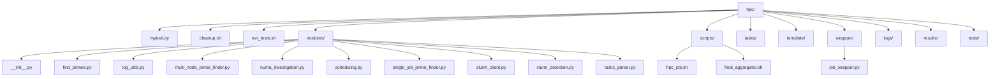
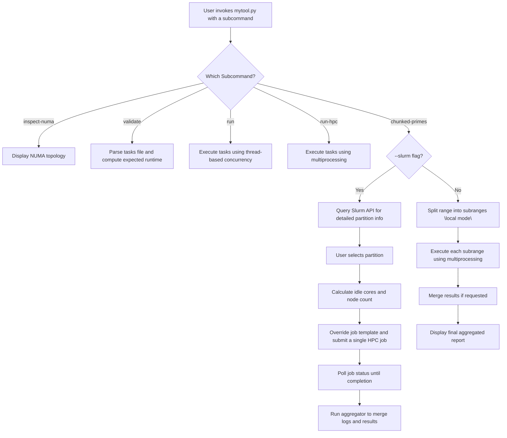

# HPC Tool

This project is a command‐line tool designed for scheduling and running HPC tasks. It supports both local concurrency and Slurm cluster job submission. It includes several subcommands to inspect system topology, validate task files, and run tasks using either thread-based or multiprocessing concurrency. In addition, it demonstrates “chunked-prime” processing in two modes:
- **Local Mode:** The specified numeric range is split into chunks based on the local CPU count.
- **Slurm Mode:** A single HPC job is submitted via the Slurm REST API. The tool dynamically queries the chosen partition to determine available nodes and cores, overrides the job template accordingly, and submits a job that internally distributes the work.

## Table of Contents

- [HPC Tool](#hpc-tool)
  - [Table of Contents](#table-of-contents)
  - [Installation](#installation)
  - [Usage](#usage)
    - [Subcommands](#subcommands)
  - [How It Works](#how-it-works)
    - [Local Concurrency](#local-concurrency)
    - [Slurm Integration and Chunking](#slurm-integration-and-chunking)
    - [Aggregated Logs and Results](#aggregated-logs-and-results)
  - [Directory Structure](#directory-structure)
  - [Explanation:](#explanation)
  - [Testing](#testing)
  - [Limitations](#limitations)
  - [Mermaid Diagrams](#mermaid-diagrams)
    - [Operation Flow](#operation-flow)
  - [Conclusion](#conclusion)
    - [This README explains:](#this-readme-explains)

## Installation

1. **Clone the repository:**
git clone <repository_url> && cd hpc

2. **Set up and activate a virtual environment:**
python3 -m venv virtual-python-dirs/hpc-public && source virtual-python-dirs/hpc-public/bin/activate

3. **Install the required packages:**
pip install -r requirements.txt

4. **Configure the Slurm REST API:**
Ensure the Slurm REST API is installed and its UNIX socket is available at `/var/run/slurmrestd/slurmrestd.sock`. (Refer to the [Slurm REST API documentation](https://slurm.schedmd.com/slurmrestd.html) for setup instructions.)

## Usage

Run the main CLI tool as follows:
./mytool.py <subcommand> [options]

### Subcommands

1. **inspect-numa**  
   Displays NUMA topology (if py‑libnuma is installed).
./mytool.py inspect-numa

2. **validate**  
Validates a DAG tasks file and prints the expected runtime.
./mytool.py validate tasks/example.txt

3. **run**  
Runs tasks from a file using thread-based concurrency.
./mytool.py run tasks/example.txt --max-workers=2

4. **run-hpc**  
Runs tasks from a file using multiprocessing (HPC-style).
./mytool.py run-hpc tasks/example.txt --max-procs=2

5. **chunked-primes**  
Demonstrates prime range processing. Two modes are supported:
- **Local Mode:** Splits the range into chunks and runs them using local multiprocessing.
  ```
  ./mytool.py chunked-primes 1 1000 --chunks=4 --merge-results
  ```
- **Slurm Mode:** Submits a **single HPC job** via the Slurm REST API. The tool queries partition details, dynamically calculates the available resources, overrides the job template accordingly, and submits a job that internally distributes the work.
  ```
  ./mytool.py chunked-primes 1 20000 --slurm --dynamic --run-id=Test
  ```
  When running in Slurm mode, you will be prompted to choose a partition (defaulting to `Tunninet` if none is specified) and confirm the resource request (number of idle cores and nodes). After submission, the tool polls until the job is finished and then runs an aggregator script to merge per‑rank logs and results.

## How It Works

### Schema

- **Local HPC:**
we must have a task name, run time and any dependancies.
We also simulate creating primes (a real world example) in chunks to see how this speeds it up. no name or dependancy, range only.

- **Slurm HPC:**
We again simulate primes and have a task name and instead calculated actual run time.
No dependancy needed with this HPC example of chunking by the number of cores in the Slurm compute partition.
(Future) It can be tailored with a new template to also pass allowed runtime or to take dependency jobs as well schedule wise.

### Local Concurrency

- **Tasks File Processing:**  
The tool parses a DAG tasks file (see `tasks/example.txt`), validates it, and computes the expected runtime.

- **Thread-Based Execution:**  
The `run` subcommand uses Python threads to simulate the execution of tasks.

- **Multiprocessing Execution:**  
The `run-hpc` subcommand uses Python’s multiprocessing to execute tasks concurrently (simulating an HPC environment).

- **Local Chunking:**  
In local mode for `chunked-primes`, the tool splits the numeric range into a fixed (or dynamic) number of subranges (typically matching the number of local cores) and spawns separate processes for each subrange.

### Slurm Integration and Chunking

- **Partition Querying:**  
When the `--slurm` flag is used with `chunked-primes`, the tool queries detailed partition information via the Slurm REST API (using endpoints such as `/slurm/v0.0.40/partitions` and `/slurm/v0.0.40/node/{node_name}`) and displays a detailed list of partitions (including nodes, CPUs, memory, sockets, cores per socket, and threads per core).

- **Resource Calculation:**  
The tool determines the total number of idle cores and the number of nodes available in the chosen partition. It then prompts the user to confirm the use of those resources.

- **Job Template Override:**  
The job template (found in `template/job_template.json`) contains placeholders for values like `TOTAL_CORES`, `RANGE_START`, `RANGE_END`, `RUN_ID`, as well as resource requests (`nodes`, `tasks`, `cpus_per_task`). The tool replaces these placeholders dynamically so that the submitted job accurately reflects the partition’s available resources.

- **Job Submission and Aggregation:**  
The tool submits a single HPC job via the Slurm REST API. It then polls (using `squeue`) until the job completes. Once finished, it calls an aggregator script (e.g., `scripts/final_aggregator.sh`) to merge per‑rank log files and, if applicable, to sort and aggregate the prime numbers into a final report in the `results/` directory.

### Aggregated Logs and Results

- **Per‑rank Logs:**  
Each sub-task in a multi-node job writes its log as `logs/job_<jobid>_rank_<rank>.log`.

- **Final Report:**  
The aggregator script gathers these logs, extracts (and sorts) the prime numbers found by each rank, and creates a final report (including total elapsed time and total prime count) saved as `results/final_<jobid>.txt`.

## Directory Structure

Below is a Mermaid diagram illustrating the project structure:



## Explanation:

mytool.py: Main CLI tool.
modules/: Contains all Python modules (parsing, scheduling, Slurm API, etc.).
scripts/: Contains helper scripts (e.g., the job launcher hpc_job.sh and the aggregator final_aggregator.sh).
tasks/: Contains sample task files.
template/: Contains the job template JSON (used for Slurm job submission).
wrapper/: Contains the job wrapper script.
logs/: Contains per‑rank logs from HPC jobs.
results/: Contains aggregated final reports.
tests/: Contains test run logs.

## Testing

To run the full suite of tests, use the provided run_tests.sh script. This script executes all subcommands and writes individual test logs into the tests/ directory. For example:

./run_tests.sh
Review the logs in the tests/ folder (e.g. tests/test_inspect-numa.log, tests/test_validate.log, etc.) and check the master log at tests/test_run.log for a summary.

Cleanup
To remove generated logs and results, use the cleanup.sh script. For example:

- To clean logs and results:
  ./cleanup.sh

- To also clean the tests directory:
  ./cleanup.sh --tests

## Limitations

- **Resource Mismatch:**  
  If the Slurm REST API returns unexpected values or if the job template is not adjusted to match the partition’s resources, the job may remain pending (e.g., due to `PartitionNodeLimit`).

- **API Version:**  
  This tool is built against Slurm REST API version 0.0.40. Changes in the API may require code adjustments.

- **Simulation vs. Real Work:**  
  The prime-finding functionality is simulated (using a fixed duration) unless replaced with actual computation code.

- **Error Handling:**  
  Basic error handling is included; production usage may require more robust exception management and logging.

## Mermaid Diagrams

### Operation Flow



## Conclusion

### This README explains:

Installation and configuration: Including virtualenv setup and Slurm REST API configuration.

Usage: How to run each subcommand (inspect-numa, validate, run, run-hpc, chunked-primes).

How the tool works: Detailed explanation of local concurrency versus Slurm job submission and chunking.

Directory structure: Illustrated with a Mermaid diagram.

Testing and cleanup: Instructions for using run_tests.sh and cleanup.sh.

Limitations: Known issues and API version dependencies.
